# 🎓 Exam Room Allocation System

A full-stack web application for efficiently allocating classrooms for exams using a **greedy algorithm** that minimizes room usage while preferring lower-floor classrooms.


---

## 🌐 Live Demo

| Service | URL | Platform |
|---------|-----|----------|
| **Frontend** | [https://assessment-five-mauve.vercel.app](https://assessment-five-mauve.vercel.app) | Vercel |
| **Backend API** | [https://assessment-unqv.vercel.app](https://assessment-unqv.vercel.app) | Vercel |

---

## 📋 Features

- ✅ **Add Classroom** - Register classrooms with capacity, floor, and washroom proximity
- ✅ **View All Classrooms** - Display all classrooms sorted by floor
- ✅ **Smart Allocation** - Allocate minimum rooms for exams using greedy algorithm
- ✅ **Lower Floor Priority** - Prefers lower-floor classrooms first
- ✅ **Capacity Validation** - Shows error when seats are insufficient

---

## 🏗️ System Architecture


---

## 🔄 Allocation Algorithm

The system uses a **greedy algorithm** to allocate the minimum number of rooms:

```mermaid
flowchart TD
    A[📥 Input: Total Students] --> B[📚 Fetch All Classrooms]
    B --> C[🔢 Sort by Floor ASC, Capacity DESC]
    C --> D{👥 Remaining > 0?}
    D -->|Yes| E[➕ Allocate Next Room]
    E --> F[➖ Subtract Capacity]
    F --> D
    D -->|No| G[✅ Return Allocated Rooms]
    D -->|All Used & Still Remaining| H[❌ Not Enough Seats]
```



**Algorithm Strategy:**
1. Sort classrooms by **floor number (ascending)** - prefer lower floors
2. Then by **capacity (descending)** - fill larger rooms first
3. Allocate rooms until total capacity ≥ required students

---

## 📁 Project Structure

```
ayush-assignment/
├── backend/                   # Express.js API
│   ├── src/
│   │   ├── config/db.js       # MongoDB connection
│   │   ├── models/Classroom.js
│   │   ├── controllers/classroomController.js
│   │   ├── routes/classroomRoutes.js
│   │   └── utils/allocator.js # Greedy algorithm
│   ├── index.js               # Server entry
│   ├── .env.example
│   └── package.json
│
└── frontned/                  # Next.js Frontend
    ├── src/
    │   ├── app/               # App Router pages
    │   ├── components/        # UI components
    │   │   ├── ui/            # shadcn components
    │   │   ├── classroom/     # Classroom components
    │   │   └── allocation/    # Allocation components
    │   ├── hooks/             # React Query hooks
    │   ├── lib/api.ts         # API client
    │   └── types/             # TypeScript types
    └── package.json
```

---

## 🗄️ Data Model


---

## 🔌 API Endpoints

Base URL: `http://localhost:3000` (local) | `https://assessment-unqv.vercel.app` (production)

### Health Check
```http
GET /
```
**Response:**
```json
{
  "success": true,
  "message": "Exam Room Allocation API is running"
}
```

---

### Add Classroom
```http
POST /api/classrooms
Content-Type: application/json
```
**Request Body:**
```json
{
  "roomId": "R101",
  "capacity": 50,
  "floorNo": 1,
  "nearWashroom": true
}
```
**Success Response (201):**
```json
{
  "success": true,
  "message": "Classroom added successfully",
  "data": { "_id": "...", "roomId": "R101", "capacity": 50, ... }
}
```

---

### Get All Classrooms
```http
GET /api/classrooms
```
**Response (200):**
```json
{
  "success": true,
  "count": 4,
  "data": [
    { "roomId": "R101", "capacity": 50, "floorNo": 1, "nearWashroom": true },
    { "roomId": "R102", "capacity": 40, "floorNo": 1, "nearWashroom": false }
  ]
}
```

---

### Allocate Exam Rooms
```http
POST /api/classrooms/allocate
Content-Type: application/json
```
**Request Body:**
```json
{
  "totalStudents": 80
}
```
**Success Response (200):**
```json
{
  "success": true,
  "message": "Rooms allocated successfully",
  "allocatedRooms": [
    { "roomId": "R101", "capacity": 50, "floorNo": 1 },
    { "roomId": "R102", "capacity": 40, "floorNo": 1 }
  ],
  "totalRoomsAllocated": 2,
  "totalCapacityAllocated": 90,
  "excessCapacity": 10
}
```
**Error Response (400):**
```json
{
  "success": false,
  "message": "Not enough seats available",
  "shortfall": 355
}
```

---

## 🚀 Getting Started

### Prerequisites
- Node.js 18+
- MongoDB Atlas account
- npm or yarn

### Backend Setup

```bash
# Navigate to backend
cd backend

# Install dependencies
npm install

# Create .env file
cp .env.example .env

# Update .env with your MongoDB URI
# MONGODB_URI=mongodb+srv://<user>:<pass>@cluster.mongodb.net/exam_allocation

# Start development server
npm run dev
```

### Frontend Setup

```bash
# Navigate to frontend
cd frontned

# Install dependencies
npm install

# Create .env.local file
echo "NEXT_PUBLIC_API_URL=http://localhost:3000" > .env.local

# Start development server
npm run dev
```

---

## 🌍 Deployment

Both frontend and backend are deployed on **Vercel**.

### Backend (Vercel)

1. Import project on [Vercel](https://vercel.com)
2. Configure:
   - **Root Directory:** `backend`
   - **Framework Preset:** Other
   - **Build Command:** `npm install`
   - **Output Directory:** *(leave empty)*
   - **Install Command:** `npm install`
3. Add environment variable:
   - `MONGODB_URI` = Your MongoDB Atlas connection string

### Frontend (Vercel)

1. Import project on [Vercel](https://vercel.com)
2. Configure:
   - **Root Directory:** `frontned`
   - **Framework Preset:** Next.js
3. Add environment variable:
   - `NEXT_PUBLIC_API_URL` = `https://assessment-unqv.vercel.app`

---

## 🛠️ Tech Stack

### Frontend
| Technology | Purpose |
|------------|---------|
| Next.js 14 | React framework with App Router |
| TypeScript | Type safety |
| Tailwind CSS | Utility-first styling |
| shadcn/ui | UI component library |
| React Query | Server state management |
| React Hook Form | Form handling |
| Zod | Schema validation |
| Lucide React | Icons |

### Backend
| Technology | Purpose |
|------------|---------|
| Express.js | Node.js web framework |
| Mongoose | MongoDB ODM |
| MongoDB Atlas | Cloud database |
| CORS | Cross-origin support |
| dotenv | Environment variables |

---

## 📄 License

This project is licensed under the ISC License.

---

## 👨‍💻 Author

Built with ❤️ for efficient exam management.
